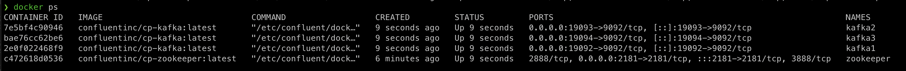
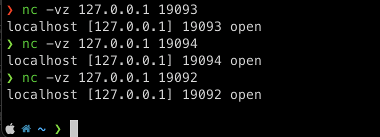
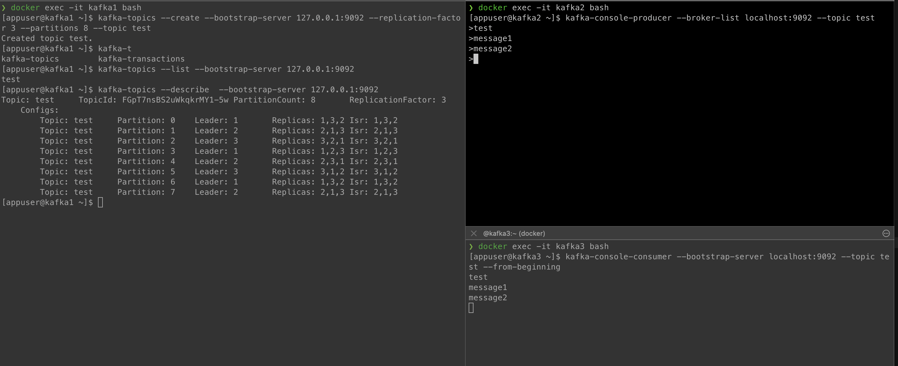
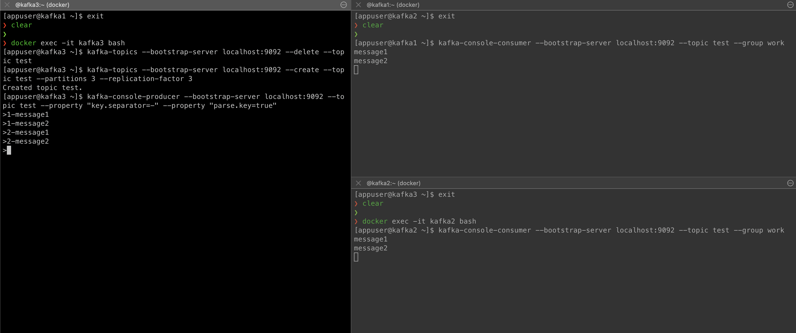

#### 1. Запустить контейнеры kafka
```
docker-compose -f kafka.yaml up
```


#### 2. Проверить доступность
```
nc -vz 127.0.0.1 19092
```


#### 3. Создать topic и прочитать данные из него
```
kafka-topics --create —-bootstrap-server 127.0.0.1:9092 --replication-factor 3 --partitions 8 --topic test
```
```
kafka-topics —-describe —bootstrap-server 127.0.0.1:9092
```
```
kafka-console-consumer —-bootstrap-server localhost:9092 --topic test --from-beginning
```

#### 4. Создать topic и прочитать данные из него через consumer group

